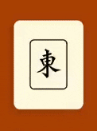
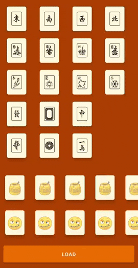

# PlaceHolderRecyclerView
[](https://android-arsenal.com/details/1/8193)
    
    

A RecyclerView that can switch between items and placeholders.  
This libs doesn't force a placehoder type, the developer is responsible for creating one, checkout the sample module and see how simple it is.  

You can use the best beloved [Shimmer-Android](http://facebook.github.io/shimmer-android/), a [Lottie](https://airbnb.design/lottie/) animation or even [Property Animation](https://developer.android.com/guide/topics/resources/animation-resource). Use your imagination, it's your placeholder 😊

# Installation

PlaceHolderRecyclerView is distributed through [Maven Central](https://search.maven.org/artifact/com.github.guilhe/placeholder-recyclerview), [Jcenter](https://bintray.com/gdelgado/android/PlaceHolderRecyclerView) and [Jitpack](https://jitpack.io/#GuilhE/PlaceHolderRecyclerView).

```groovy
implementation 'com.github.guilhe:placeholder-recyclerview:${LATEST_VERSION}'
```
[](https://search.maven.org/search?q=g:com.github.guilhe%20AND%20placeholder-recyclerview) [](https://bintray.com/gdelgado/android/PlaceHolderRecyclerView/_latestVersion) 

## Usage

```xml
<com.github.guilhe.views.PlaceHolderRecyclerView
        android:id="@+id/my_RecyclerView"
        android:layout_width="match_parent"
        android:layout_height="match_parent" />
```
```kotlin
class MyItemsPlaceHolderAdapter : ..., PlaceHolderAdapter { ... }

private val itemsAdapter = MyItemsAdapter()
...
with(binding.myRecyclerView) {
    adapter = itemsAdapter
    holdersAdapter = MyItemsPlaceHolderAdapter()
    holdersItemDecoration = MyItemsDecoration() //if needed
}
...
viewModel.items.observe(this, { itemsAdapter.update(it) })
viewModel.isLoading.observe(this, { isLoading -> binding.myRecyclerView.toggleHoldersAdapter(isLoading) })
```

  

Don't recognise those chinese characters? They're from an awesome game called [Mahjong](https://en.wikipedia.org/wiki/Mahjong)  
Lottie animation by [puput Santoso](https://lottiefiles.com/puput_santoso)

    
## Dependencies
- [androidx.recyclerview:recyclerview](https://developer.android.com/jetpack/androidx/releases/recyclerview)

## Bugs and Feedback

For bugs, questions and discussions please use the [Github Issues](https://github.com/GuilhE/PlaceHolderRecyclerView/issues).

## LICENSE

Copyright (c) 2020-present GuilhE

Licensed under the Apache License, Version 2.0 (the "License");
you may not use this file except in compliance with the License.
You may obtain a copy of the License at

<http://www.apache.org/licenses/LICENSE-2.0>

Unless required by applicable law or agreed to in writing, software
distributed under the License is distributed on an "AS IS" BASIS,
WITHOUT WARRANTIES OR CONDITIONS OF ANY KIND, either express or implied.
See the License for the specific language governing permissions and
limitations under the License.
